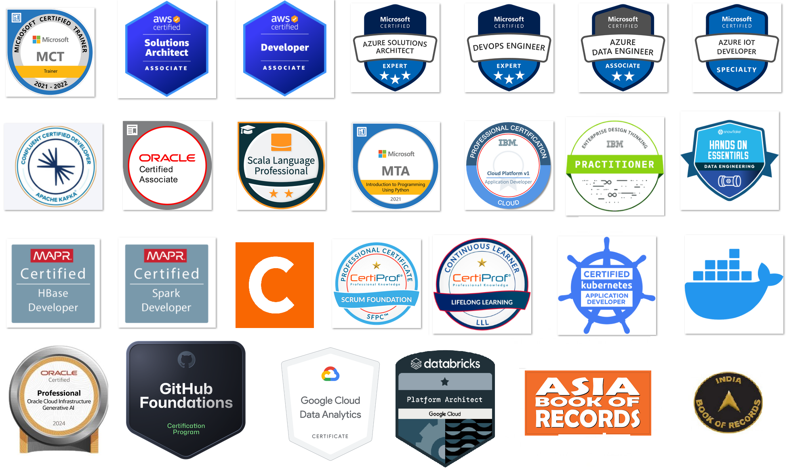
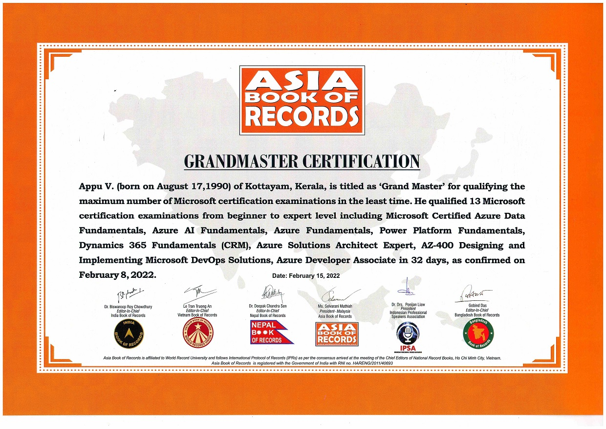
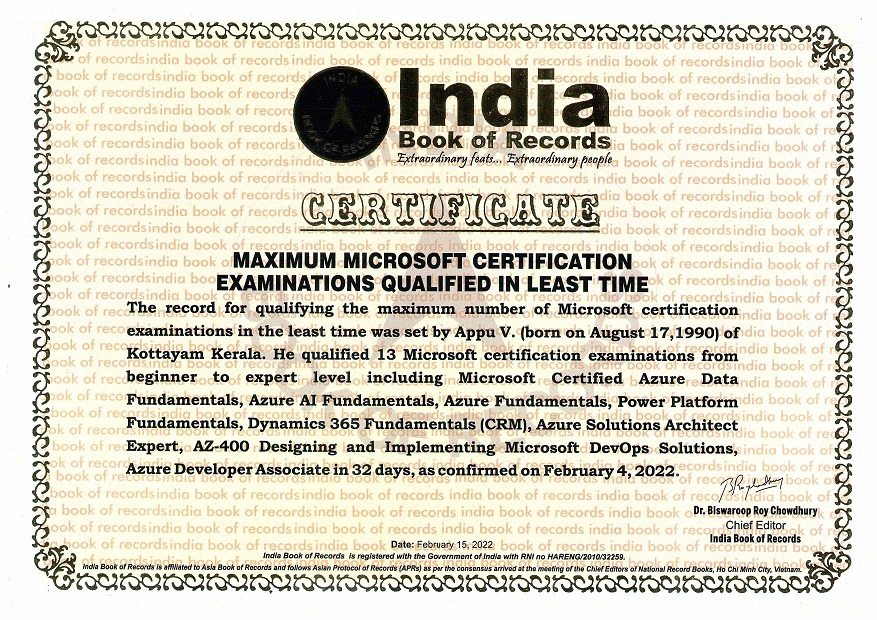

### Hey there!  :wave:
- 7+ years into Data Engineering, Cloud and Big Data :computer:
- From Kerala, India :india:
- Interested in solving challenges 
- Passionate Adventure Traveler :compass: :airplane: :world_map:
- Microsoft Certified Trainer :medal_military:
- Certified in Hadoop, Spark, Kafka, AWS and Azure :trophy:
- India Book of Records and Asia Book of Records Grand Master holder :1st_place_medal:	

#### Certifications  :medal_sports:

#### Records  :1st_place_medal:

#### Other Links :link:
- [Linkedin](https://www.linkedin.com/in/appuv)
- [Medium](https://medium.com/@masterappu)
- [Youtube](https://www.youtube.com/channel/UCSMeGTVvGIFpBP9BhT_89Aw)
- [Hackerrank](https://www.hackerrank.com/masterappu)
- [Credly](https://www.credly.com/users/appuv/badges)
- [Accredible](https://www.credential.net/profile/appuv329546/wallet)
- [Qwiklabs](https://qwiklabs.com/public_profiles/aa816972-ce94-4ab8-bedd-18b7f7f3ac15)
- [Degreed](https://degreed.com/profile/appuv/overview)
- [IBR](https://indiabookofrecords.in/maximum-microsoft-certification-examinations-qualified-in-least-time/)
- [ABR](https://www.asiabookofrecords.com/grand-master-appu-v/)
